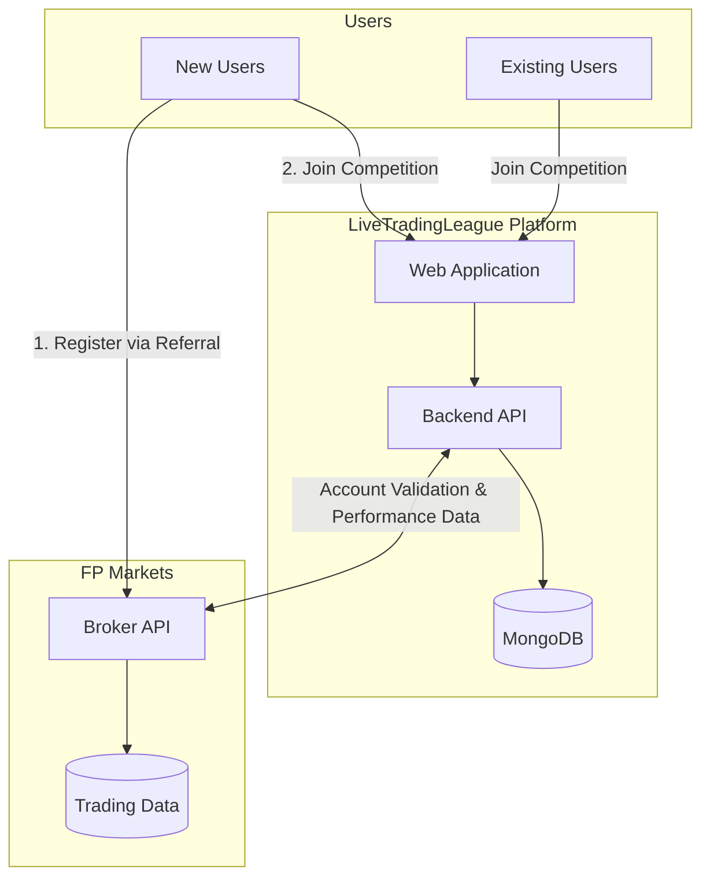
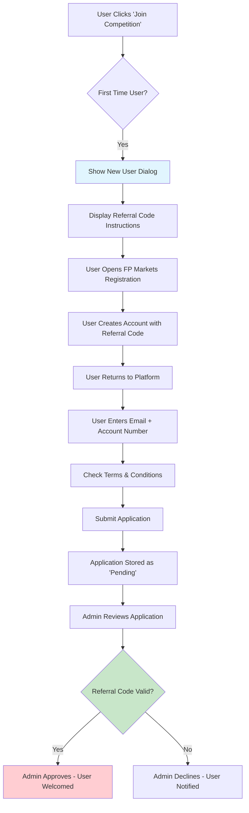
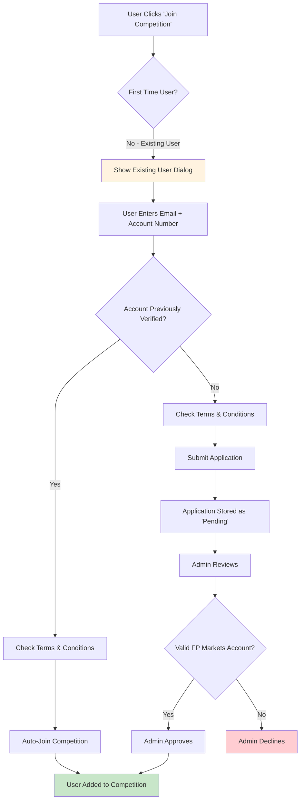
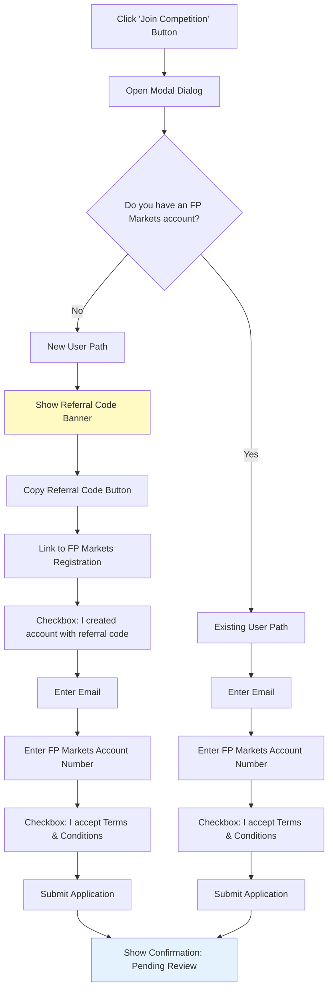
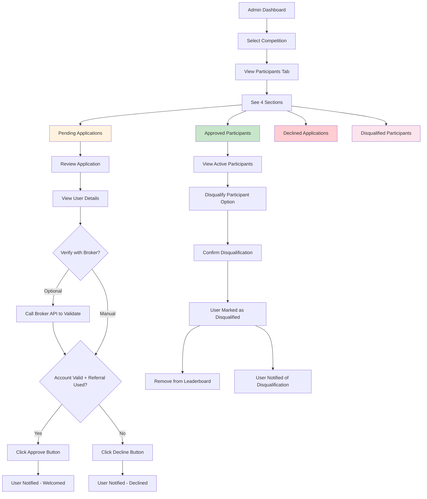
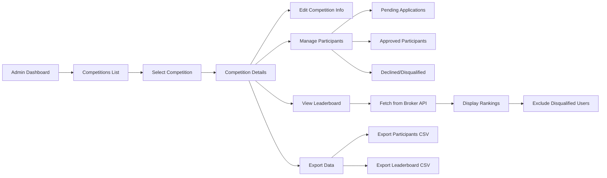
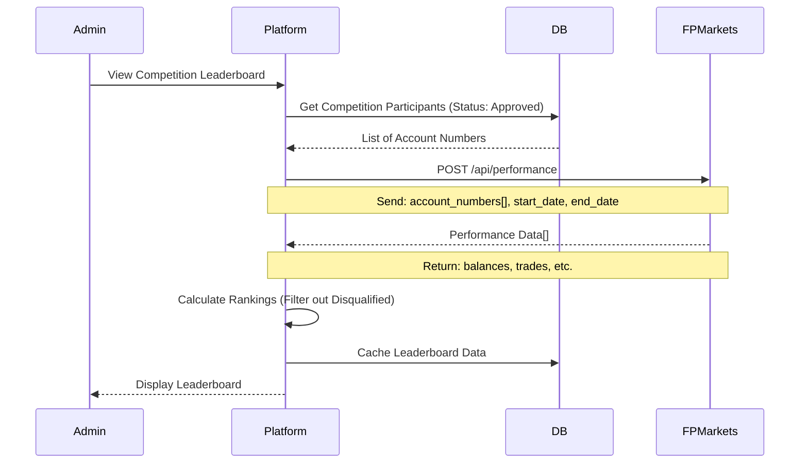
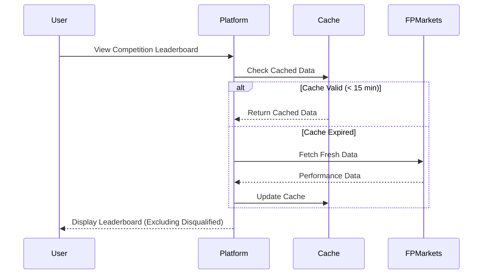
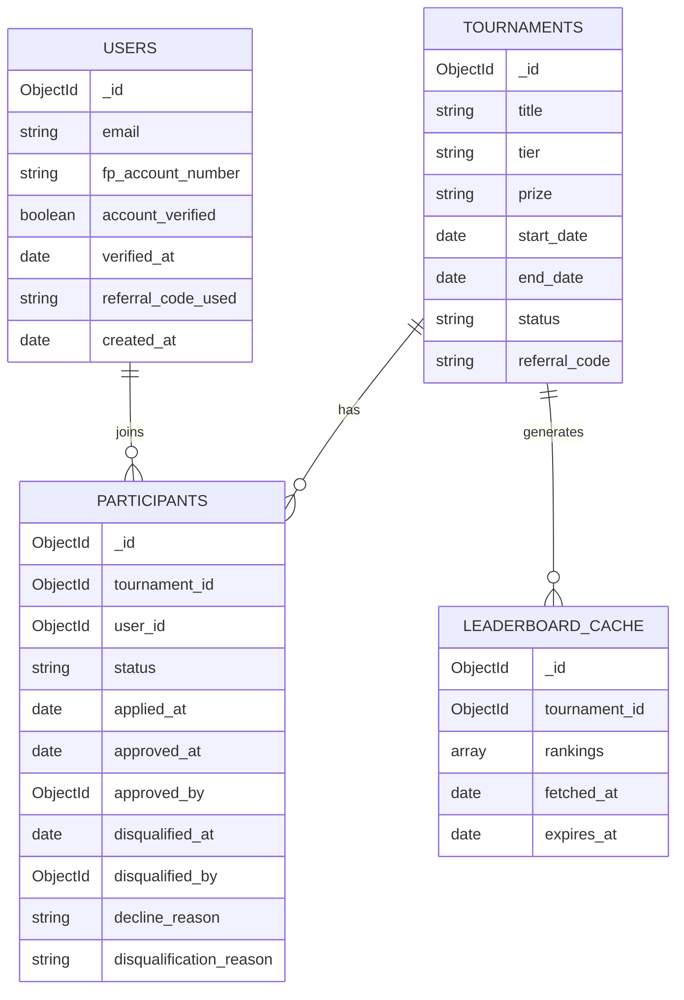
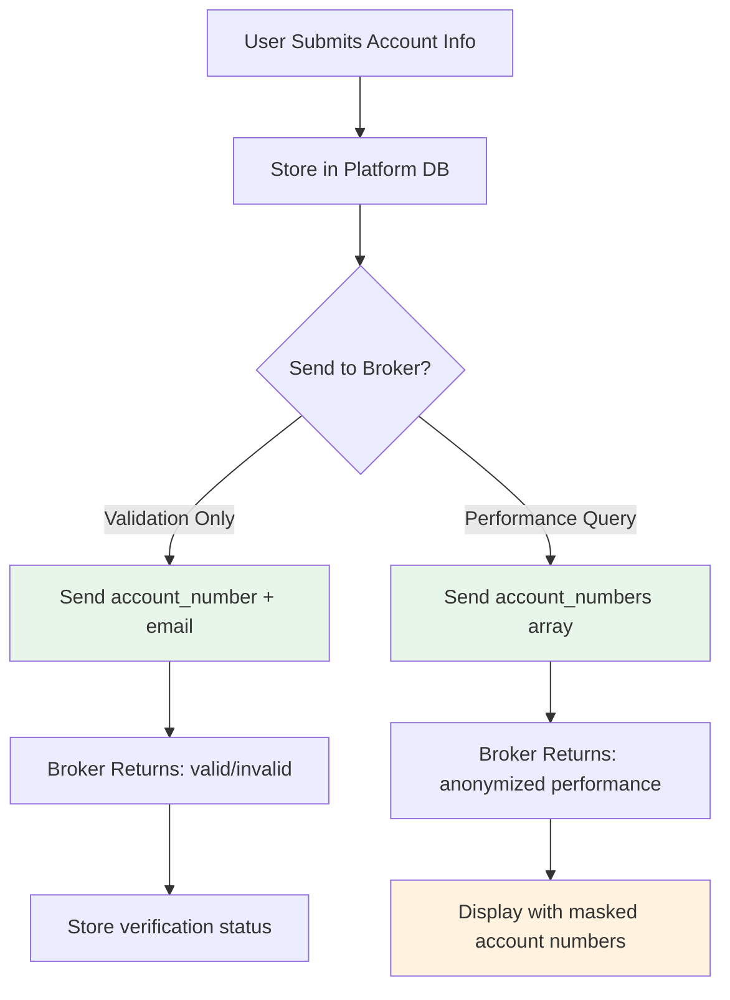

# LiveTradingLeague - Broker Integration & User Flow Requirements

## Document Info
- **Version:** 1.2
- **Date:** February 2026
- **Status:** Draft for Stakeholder Review
- **Broker Partner:** FP Markets

---

## 1. Executive Summary

This document outlines the technical requirements for integrating FP Markets broker data to power the LiveTradingLeague competition platform. It covers user registration flows, tournament participation, leaderboard data requirements, and admin management capabilities, including the ability to disqualify participants during a live competition.

---

## 2. High-Level System Architecture



---

## 3. User Registration Flows

### 3.1 New User Flow



### 3.2 Existing User Flow



### 3.3 Join Competition Dialog Flow



---

## 4. Admin Management Flow

### 4.1 Managing Competition Participants



### 4.2 Admin Dashboard - Competition Management



---

## 5. Leaderboard Data Flow

### 5.1 Leaderboard Generation Flow



### 5.2 Public Leaderboard Display



---

## 6. Broker API Requirements

### 6.1 Required Endpoints from FP Markets

| Endpoint | Method | Purpose | Priority |
|----------|--------|---------|----------|
| `/api/account/validate` | POST | Validate account exists and referral code used | **Critical** |
| `/api/account/performance` | POST | Get trading performance for accounts | **Critical** |
| `/api/account/info` | GET | Get account metadata (creation date, status) | High |
| `/api/referral/verify` | POST | Verify specific referral code was used | High |

### 6.2 Account Validation Request

**Endpoint:** `POST /api/account/validate`

**Request:**
```json
{
  "account_number": "12345678",
  "email": "user@example.com",
  "referral_code": "AFFASAD"
}
```

**Expected Response:**
```json
{
  "valid": true,
  "account_number": "12345678",
  "email_match": true,
  "referral_code_used": true,
  "account_status": "active",
  "account_created_at": "2026-01-15T10:30:00Z",
  "account_type": "live"
}
```

### 6.3 Performance Data Request

**Endpoint:** `POST /api/account/performance`

**Request:**
```json
{
  "account_numbers": ["12345678", "87654321", "11223344"],
  "start_date": "2026-01-01T00:00:00Z",
  "end_date": "2026-01-31T23:59:59Z",
  "metrics": ["trades_count", "balance"]
}
```

**Expected Response:**
```json
{
  "competition_period": {
    "start": "2026-01-01T00:00:00Z",
    "end": "2026-01-31T23:59:59Z"
  },
  "accounts": [
    {
      "account_number": "12345678",
      "display_name": "Trader***78",
      "metrics": {
        "starting_balance": 10000.00,
        "current_balance": 14567.89,
        "trades_count": 127
      },
      "last_trade_at": "2026-01-30T14:22:00Z",
      "status": "active"
    }
  ]
}
```

---

## 7. Data Model Changes

### 7.1 New Collections Required



### 7.2 Users Collection Schema

```javascript
{
  _id: ObjectId,
  email: String,                    // User email
  fp_account_number: String,        // FP Markets account number
  display_name: String,             // Optional display name
  account_verified: Boolean,        // Verified with broker
  verified_at: Date,                // When verified
  referral_code_used: String,       // Which referral code used
  is_new_user: Boolean,             // First time on platform
  created_at: Date,
  updated_at: Date
}
```

### 7.3 Participants Collection Schema

```javascript
{
  _id: ObjectId,
  tournament_id: ObjectId,          // Reference to tournament
  user_id: ObjectId,                // Reference to user
  status: String,                   // 'pending' | 'approved' | 'declined' | 'disqualified'
  applied_at: Date,
  reviewed_at: Date,
  reviewed_by: ObjectId,            // Admin who reviewed
  decline_reason: String,           // If declined
  disqualified_at: Date,            // When disqualified
  disqualified_by: ObjectId,        // Admin who disqualified
  disqualification_reason: String,  // Reason for disqualification
  notes: String                     // Admin notes
}
```

---

## 8. Security & Privacy Considerations

### 8.1 Data Handling



---

## 9. Implementation Phases

### Phase 1: User Registration (MVP)
- [x] Join competition dialog (new/existing user paths)
- [x] Users collection in MongoDB
- [x] Participants collection with status tracking
- [x] Basic admin participant management UI
- [ ] **Terms and Conditions agreement checkbox**

### Phase 2: Admin Management
- [ ] Competition participant tabs (pending/approved/declined/disqualified)
- [ ] Approve/decline buttons with notifications
- [ ] **Disqualification system (mark as disqualified, remove from leaderboard)**
- [ ] Participant export functionality
- [ ] Admin notes and tracking

### Phase 3: Broker Integration
- [ ] Account validation API integration
- [ ] Performance data API integration
- [ ] Leaderboard caching system
- [ ] Error handling and fallbacks

---

## 10. Acceptance Criteria

### For User Registration
- [ ] Users can indicate new vs existing status
- [ ] New users see referral code prominently
- [ ] Applications are stored with pending status
- [ ] Users receive confirmation of submission
- [ ] **User cannot submit application without checking "I have read Terms and Conditions"**

### For Admin Management
- [ ] Admins can view participants by status (including Disqualified)
- [ ] Admins can approve/decline with one click
- [ ] **Admins can disqualify any active participant at any time**
- [ ] **Disqualified participants are immediately removed from the leaderboard**
- [ ] **Disqualification on platform does NOT affect the user's account at FP Markets**
- [ ] Actions are logged for audit

---

## Appendix B: Notification Templates

### Application Approved
> Congratulations! You've been approved to participate in **{competition_name}**. The competition runs from {start_date} to {end_date}. Good luck!

### Application Declined
> Unfortunately, your application to join **{competition_name}** was not approved. Reason: {reason}. Please contact support if you believe this is an error.

### Participant Disqualified
> We regret to inform you that you have been disqualified from **{competition_name}**. Reason: {reason}. This decision only affects your participation in this competition and does not impact your FP Markets trading account.
