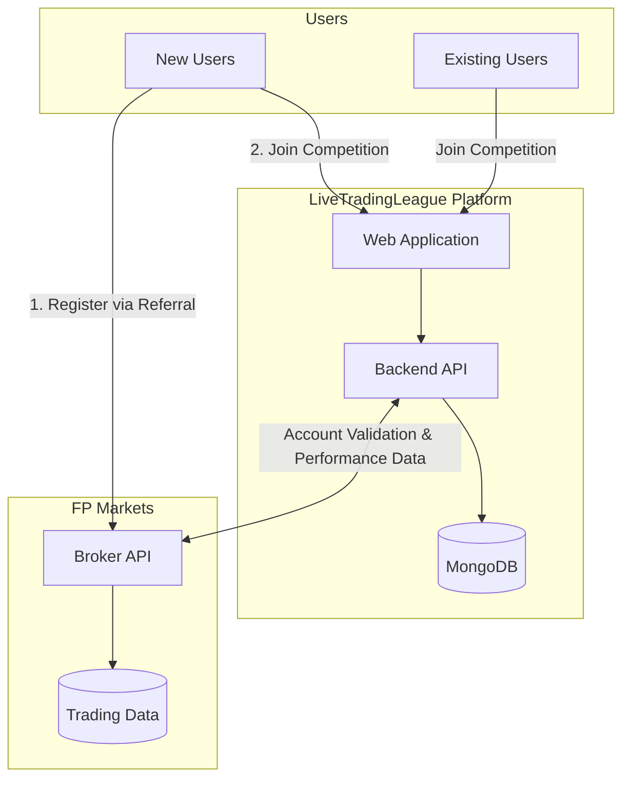
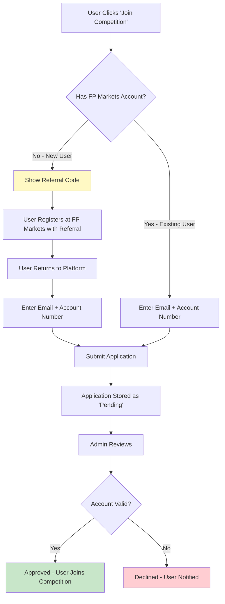
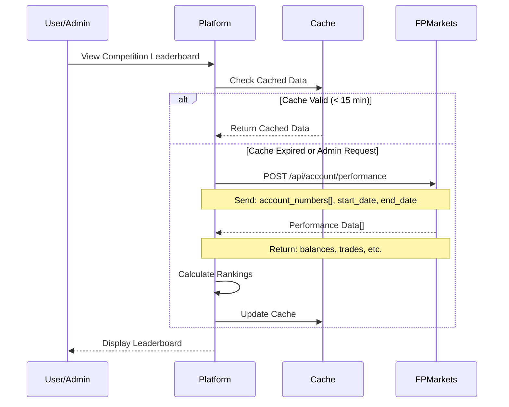
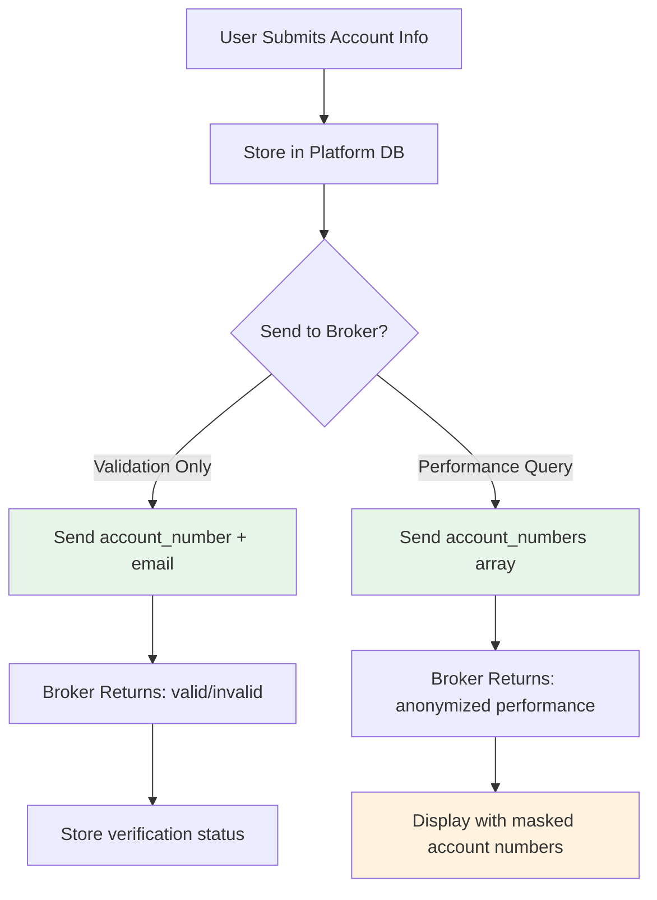
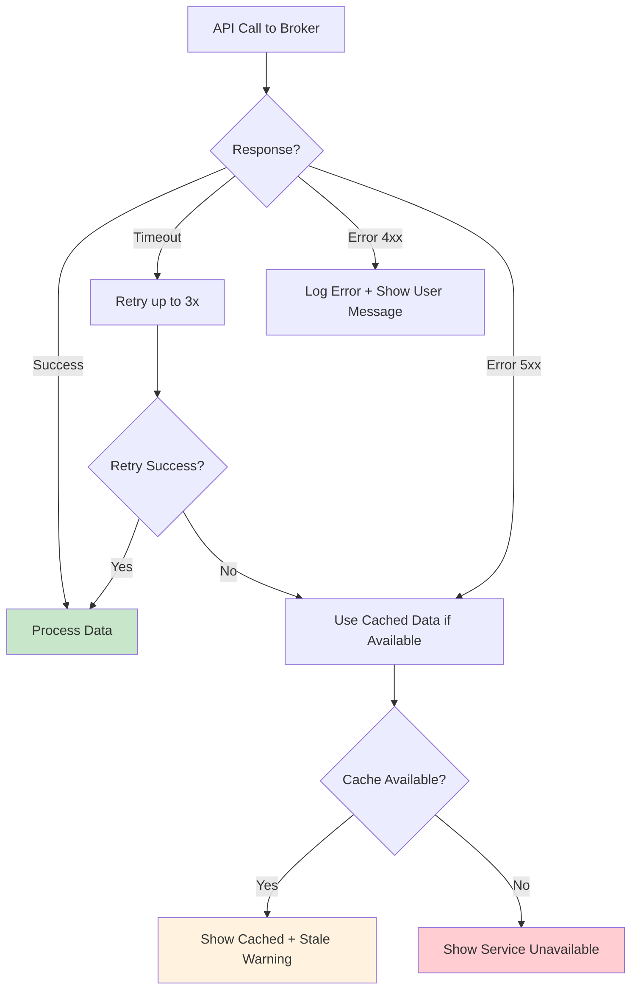

# LiveTradingLeague - FP Markets Integration Requirements

## Document Info
- **Version:** 1.1
- **Date:** February 2026
- **Status:** Draft for Partner Review
- **From:** LiveTradingLeague Team
- **To:** FP Markets Technical Team

---

## 1. Executive Summary

This document outlines the API requirements LiveTradingLeague needs from FP Markets to power our trading competition platform. We require endpoints for account validation and performance data retrieval to manage competition participants and generate leaderboards.

---

## 2. High-Level System Architecture



---

## 3. User Registration Flow



---

## 4. Leaderboard Data Flow



---

## 5. Required API Endpoints

### 5.1 Endpoint Summary

| Endpoint | Method | Purpose | Priority |
|----------|--------|---------|----------|
| `/api/account/validate` | POST | Validate account exists and referral code used | **Critical** |
| `/api/account/performance` | POST | Get trading performance for accounts | **Critical** |
| `/api/account/info` | GET | Get account metadata (creation date, status) | High |
| `/api/referral/verify` | POST | Verify specific referral code was used | High |

### 5.2 Account Validation Request

**Endpoint:** `POST /api/account/validate`

**Request:**
```json
{
  "account_number": "12345678",
  "email": "user@example.com",
  "referral_code": "AFFASAD"
}
```

**Expected Response:**
```json
{
  "valid": true,
  "account_number": "12345678",
  "email_match": true,
  "referral_code_used": true,
  "account_status": "active",
  "account_created_at": "2026-01-15T10:30:00Z",
  "account_type": "live"
}
```

### 5.3 Performance Data Request

**Endpoint:** `POST /api/account/performance`

**Request:**
```json
{
  "account_numbers": ["12345678", "87654321", "11223344"],
  "start_date": "2026-01-01T00:00:00Z",
  "end_date": "2026-01-31T23:59:59Z",
  "metrics": ["trades_count", "balance"]
}
```

**Expected Response:**
```json
{
  "competition_period": {
    "start": "2026-01-01T00:00:00Z",
    "end": "2026-01-31T23:59:59Z"
  },
  "accounts": [
    {
      "account_number": "12345678",
      "display_name": "Trader***78",
      "metrics": {
        "starting_balance": 10000.00,
        "current_balance": 14567.89,
        "trades_count": 127
      },
      "last_trade_at": "2026-01-30T14:22:00Z",
      "status": "active"
    }
  ]
}
```

### 5.4 Data Requirements Summary

| Data Field | Description | Used For |
|------------|-------------|----------|
| `account_number` | FP Markets account ID | User identification |
| `starting_balance` | Balance at competition start | Ranking calculation |
| `current_balance` | Current account balance | Ranking calculation & Display |
| `trades_count` | Number of trades | Activity verification |
| `last_trade_at` | Last trade timestamp | Activity check |
| `account_status` | Account status | Eligibility check |

---

## 6. Security & Privacy Considerations

### 6.1 Data Flow



### 6.2 Privacy Requirements

| Data | Storage | Display | Shared with Broker |
|------|---------|---------|-------------------|
| Email | Encrypted | Never public | For validation only |
| Account Number | Encrypted | Masked (****1234) | Yes |
| Performance Data | Cached | Public on leaderboard | N/A (from broker) |
| Referral Code | Plain | Admin only | For validation |

---

## 7. Questions for FP Markets

### Technical Questions

1. **API Authentication:** What authentication method will be used? (API Key, OAuth, JWT)
2. **Rate Limits:** What are the rate limits for API calls?
3. **Data Freshness:** How often is performance data updated?
4. **Webhook Support:** Can you send webhooks for account events?
5. **Sandbox Environment:** Is a test/sandbox environment available?

### Data Questions

1. **Account Anonymization:** Can you provide masked account numbers for public display?
2. **Historical Data:** How far back can we query performance data?
3. **Real-time Data:** Is real-time balance data available or is there a delay?
4. **Referral Verification:** Can you confirm referral code usage programmatically?

---

## Appendix A: API Error Handling

**Request:** Please provide documentation on your API error response format and error codes so we can implement proper error handling on our frontend.

We anticipate needing to handle the following scenarios:



### Information Needed from FP Markets

- List of possible error codes and their meanings
- Recommended retry strategies
- Rate limit error responses
- Authentication error responses
- Suggested user-facing error messages for common scenarios
