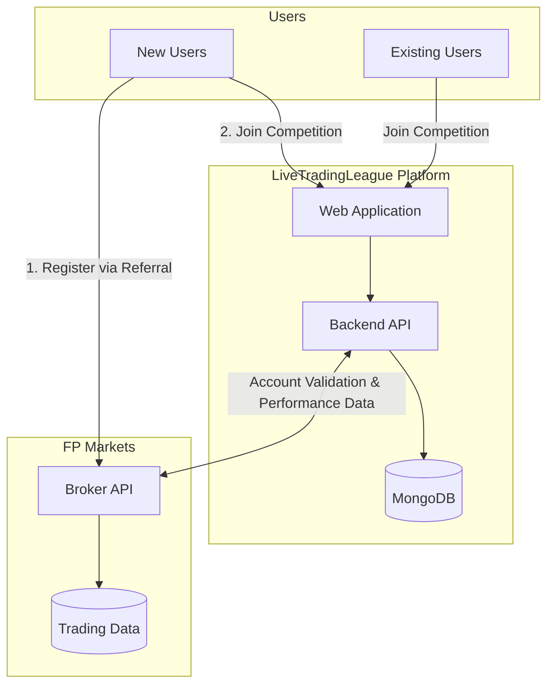
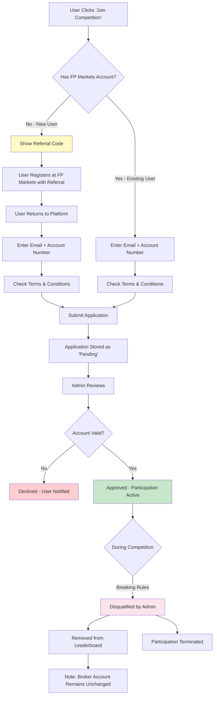
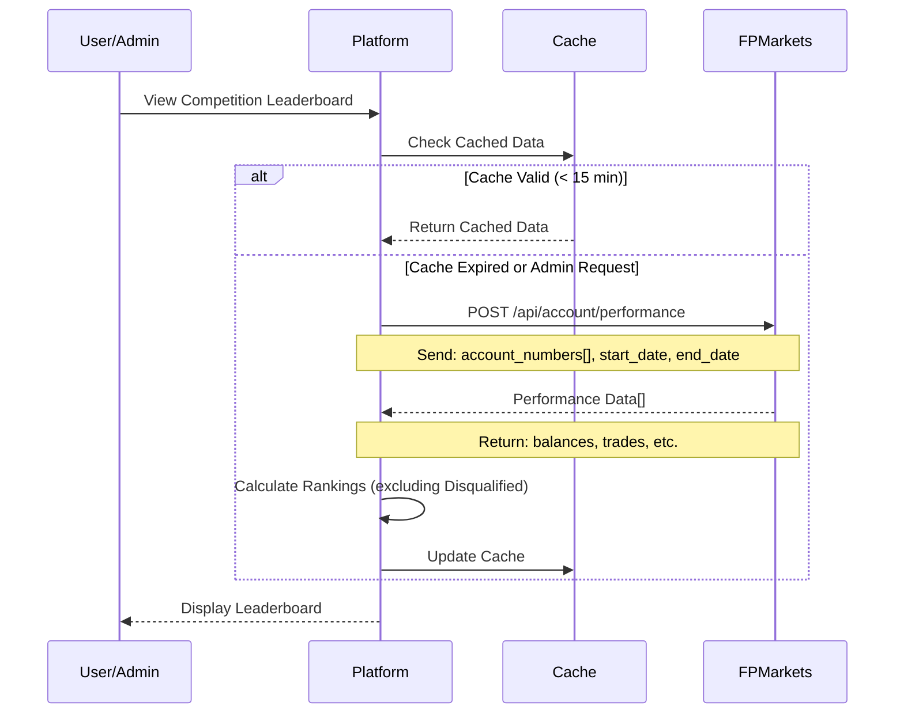
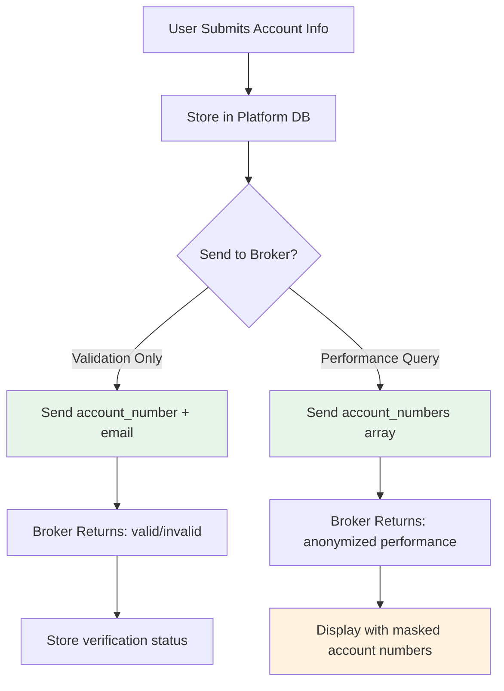
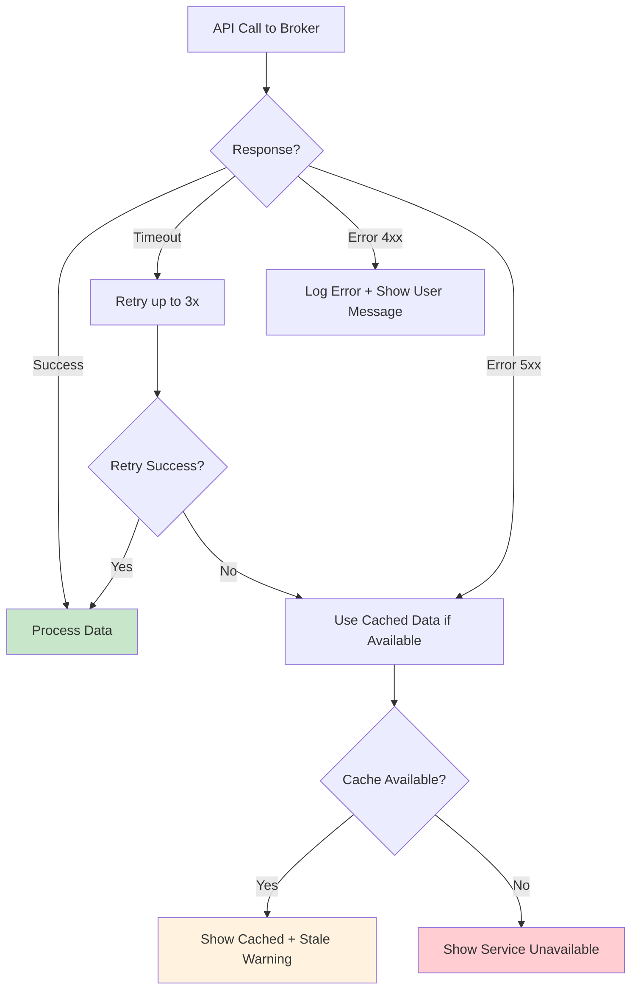

# LiveTradingLeague - FP Markets Integration Requirements

## Document Info
- **Version:** 1.2
- **Date:** February 2026
- **Status:** Draft for Partner Review
- **From:** LiveTradingLeague Team
- **To:** FP Markets Technical Team

---

## 1. Executive Summary

This document outlines the API requirements LiveTradingLeague needs from FP Markets to power our trading competition platform. We require endpoints for account validation and performance data retrieval to manage competition participants and generate leaderboards. Version 1.2 includes considerations for participant disqualification management.

---

## 2. High-Level System Architecture

---

## 3. User Registration & Lifecycle Flow

---

## 4. Leaderboard Data Flow

---

## 5. Required API Endpoints

### 5.1 Endpoint Summary

| Endpoint | Method | Purpose | Priority |
|----------|--------|---------|----------|
| `/api/account/validate` | POST | Validate account exists and referral code used | **Critical** |
| `/api/account/performance` | POST | Get trading performance for accounts | **Critical** |
| `/api/account/info` | GET | Get account metadata (creation date, status) | High |
| `/api/referral/verify` | POST | Verify specific referral code was used | High |

---

## 6. Security & Privacy Considerations

### 6.1 Data Flow

### 6.2 Platform Compliance & Broker Integrity

- **Disqualification Independence:** A disqualification on the LiveTradingLeague platform for rule-breaking (e.g., unauthorized trading strategies, late entry, etc.) is strictly a platform-level action. It **does not** require any status change on the FP Markets side.
- **Data Refresh:** Performance data is queried periodically to ensure leaderboard accuracy.

---

## 7. Questions for FP Markets

### Technical Questions

1. **API Authentication:** What authentication method will be used? (API Key, OAuth, JWT)
2. **Rate Limits:** What are the rate limits for API calls?
3. **Data Freshness:** How often is performance data updated?
4. **Webhook Support:** Can you send webhooks for account events?
5. **Sandbox Environment:** Is a test/sandbox environment available?

---

## Appendix A: API Error Handling

**Request:** Please provide documentation on your API error response format and error codes so we can implement proper error handling on our frontend.

We anticipate needing to handle the following scenarios:

